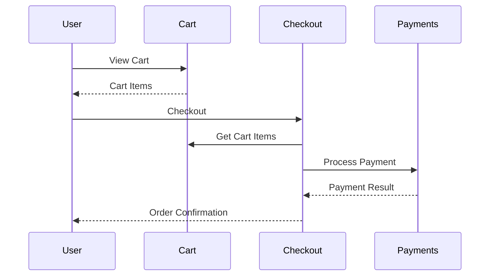

# Integration Specification

> **Purpose**: Define cross-module features that span multiple bounded contexts.
> **Output**: `features/integrations/<name>.md` - Coordination spec for multi-module work.
> **Time**: ~5-10 minutes to produce
> **Thinking**: Extended (ultrathink enabled)

ultrathink: This skill requires deep reasoning about cross-module coordination. Analyze data flows between modules, identify failure modes, design compensation strategies, and ensure the integration respects bounded context boundaries.

---

## Usage

```
/integration-spec <name> [description]
/integration-spec guest-checkout "Purchase without account creation"
/integration-spec                              # Interactive mode
```

### Arguments
- `name`: Integration identifier (kebab-case, becomes filename)
- `description`: Optional one-line description
- `--architecture <path>`: Architecture file (defaults to `docs/architecture/SYSTEM-ARCHITECTURE.md`)

---

## When to Use Integration Spec

Use `/integration-spec` instead of `/feature-brief` when:

| Indicator | Threshold |
|-----------|-----------|
| Modules touched | 3+ modules modified |
| Coordination complexity | Data flows between modules |
| Failure modes | Complex rollback/compensation |
| Shared types | New interfaces across boundaries |
| Transaction scope | Spans multiple aggregates |

### Decision Tree

```
Does feature modify 3+ modules?
├─ Yes → /integration-spec
└─ No
   └─ Does feature require coordination between modules?
      ├─ Yes → /integration-spec
      └─ No
         └─ Does feature have cross-module failure modes?
            ├─ Yes → /integration-spec
            └─ No → /feature-brief
```

---

## Output Format

Creates `features/integrations/<name>.md`:

```markdown
# Integration: [Title]

**Architecture:** docs/architecture/SYSTEM-ARCHITECTURE.md
**Type:** [User Journey | System Process | Data Flow]
**Priority:** [P0-P3]

> [One-line description of what this integration accomplishes]

---

## Overview

[2-3 paragraphs explaining the integration's purpose, why it spans modules,
and what user/system need it addresses]

---

## Modules Involved

| Module | Role | Changes Required |
|--------|------|------------------|
| [Module] | [Producer/Consumer/Both] | [Brief description] |

---

## Data Flow

```
[Module A] ──(data)──> [Module B] ──(data)──> [Module C]
     │                      │                      │
     ▼                      ▼                      ▼
  [Action]              [Action]              [Action]
```

### Flow Steps

1. **[Step Name]** ([Module])
   - Input: [data from previous step]
   - Action: [what happens]
   - Output: [data to next step]
   - Failure: [what happens on error]

---

## Coordination Points

### Synchronous Calls
| From | To | Method | Purpose |
|------|----|--------|---------|
| [Module] | [Module] | [API/Direct] | [Why] |

### Asynchronous Events
| Event | Publisher | Subscribers | Purpose |
|-------|-----------|-------------|---------|
| [Event] | [Module] | [Modules] | [Why] |

### Shared State
| Data | Owner | Readers | Consistency |
|------|-------|---------|-------------|
| [Data] | [Module] | [Modules] | [Eventual/Strong] |

---

## Failure Modes

| Failure | Impact | Detection | Recovery |
|---------|--------|-----------|----------|
| [What fails] | [Effect] | [How detected] | [Compensation] |

### Compensation Actions

```
If [Module B] fails after [Module A] succeeds:
1. [Compensation step 1]
2. [Compensation step 2]
3. [Final state]
```

---

## Shared Types

### New Interfaces
```go
// In shared/types or appropriate location
type [InterfaceName] interface {
    [Methods]
}
```

### Existing Types Used
- `Money` (Foundation) - [usage]
- `UserID` (Foundation) - [usage]

---

## API Contracts

### Endpoints Created
| Method | Path | Module | Purpose |
|--------|------|--------|---------|
| [HTTP] | [Path] | [Module] | [What it does] |

### Events Published
| Event | Module | Payload | When |
|-------|--------|---------|------|
| [Event] | [Module] | [Data] | [Trigger] |

---

## Implementation Phases

### Phase 1: [Foundation]
**Goal:** [What this achieves]
**Modules:** [Which modules]
**Deliverables:**
- [ ] [Task 1]
- [ ] [Task 2]
**Exit Criteria:** [How to verify]

### Phase 2: [Core Flow]
...

### Phase 3: [Edge Cases]
...

---

## Testing Strategy

### Unit Tests (Per Module)
| Module | Test Focus |
|--------|------------|
| [Module] | [What to test in isolation] |

### Integration Tests
| Test | Modules | Scenario |
|------|---------|----------|
| [Test] | [A, B] | [What flow] |

### E2E Tests
| Journey | Steps | Verification |
|---------|-------|--------------|
| [Journey] | [User actions] | [Expected outcome] |

---

## Rollout Plan

### Feature Flags
| Flag | Purpose | Default |
|------|---------|---------|
| [Flag] | [What it controls] | [on/off] |

### Migration Steps
1. [Step with verification]
2. [Step with verification]

---

## Related Documents

- **Architecture:** docs/architecture/SYSTEM-ARCHITECTURE.md
- **Module Specs:** [links to affected module specs]
- **Feature Dependencies:** [links to prerequisite features]
```

---

## Section Details

### Modules Involved

Identify each module's role:

| Role | Description | Example |
|------|-------------|---------|
| Producer | Creates/owns the primary data | Cart owns cart items |
| Consumer | Reads data from other modules | Checkout reads cart |
| Both | Reads and writes | Payments reads order, writes payment |

Change types:
- **New files**: Adding new domain objects, handlers
- **Modified files**: Extending existing aggregates
- **Query only**: Just reading from other modules

### Data Flow Diagram

Use ASCII art for portability:

```
┌─────────┐     ┌──────────┐     ┌──────────┐
│  Cart   │────▶│ Checkout │────▶│ Payments │
└─────────┘     └──────────┘     └──────────┘
     │               │                │
     ▼               ▼                ▼
 GetItems()     CreateOrder()    ProcessPayment()
```

Or Mermaid for richer diagrams:



### Failure Modes

Think through what can go wrong:

| Category | Examples |
|----------|----------|
| Network | Timeout, connection refused |
| Business | Insufficient funds, item out of stock |
| System | Database down, service unavailable |
| Data | Stale data, concurrent modification |

Recovery patterns:
- **Retry**: Transient failures
- **Compensate**: Undo partial work
- **Saga**: Multi-step rollback
- **Circuit breaker**: Prevent cascade

### Implementation Phases

Break integration into shippable increments:

```markdown
### Phase 1: Happy Path
- Basic flow works end-to-end
- No error handling yet
- Feature flagged off

### Phase 2: Error Handling
- Failure modes handled
- Compensation logic
- Monitoring/alerting

### Phase 3: Edge Cases
- Concurrent modifications
- Retry logic
- Performance optimization
```

---

## Examples

### Example 1: Guest Checkout

```markdown
# Integration: Guest Checkout

**Architecture:** docs/architecture/SYSTEM-ARCHITECTURE.md
**Type:** User Journey
**Priority:** P1

> Allow users to complete purchases without creating an account.

---

## Overview

Guest checkout enables one-time purchases without account creation, reducing
friction for casual buyers. The system creates a transient "guest" identity
that persists only for the checkout session and order history.

This integration spans Cart (item management), Checkout (order creation),
Payments (transaction processing), and Email (confirmation delivery).

---

## Modules Involved

| Module | Role | Changes Required |
|--------|------|------------------|
| Cart | Producer | Add guest cart support |
| Checkout | Both | Handle guest identity, create guest orders |
| Payments | Consumer | Process payment without user account |
| Email | Consumer | Send confirmation to provided email |
| Auth | Producer | Issue guest session token |

---

## Data Flow

```
┌──────┐     ┌──────┐     ┌──────────┐     ┌──────────┐     ┌───────┐
│ Auth │────▶│ Cart │────▶│ Checkout │────▶│ Payments │────▶│ Email │
└──────┘     └──────┘     └──────────┘     └──────────┘     └───────┘
    │            │              │                │               │
    ▼            ▼              ▼                ▼               ▼
 GuestToken   CartItems    GuestOrder      PaymentResult   Confirmation
```

### Flow Steps

1. **Create Guest Session** (Auth)
   - Input: None (anonymous request)
   - Action: Generate guest token with 24h expiry
   - Output: `GuestToken { id, expiresAt }`
   - Failure: Return 500, retry

2. **Add to Cart** (Cart)
   - Input: `GuestToken`, cart items
   - Action: Create/update cart with guest ID
   - Output: `Cart { guestID, items[] }`
   - Failure: Return error, no compensation needed

3. **Start Checkout** (Checkout)
   - Input: `GuestToken`, email, billing info
   - Action: Validate cart, create pending order
   - Output: `Order { id, status: pending, guestEmail }`
   - Failure: Return validation errors

4. **Process Payment** (Payments)
   - Input: `Order`, payment details
   - Action: Charge via Stripe
   - Output: `Payment { id, status, orderID }`
   - Failure: Mark order failed, preserve cart

5. **Send Confirmation** (Email)
   - Input: `Order`, `Payment`, guest email
   - Action: Send confirmation email
   - Output: Email sent (async)
   - Failure: Log error, don't fail checkout

---

## Coordination Points

### Synchronous Calls
| From | To | Method | Purpose |
|------|----|--------|---------|
| Cart | Auth | ValidateGuestToken | Verify session |
| Checkout | Cart | GetCartItems | Retrieve for order |
| Checkout | Payments | ProcessPayment | Charge customer |

### Asynchronous Events
| Event | Publisher | Subscribers | Purpose |
|-------|-----------|-------------|---------|
| OrderCompleted | Checkout | Email, Analytics | Post-purchase |
| PaymentFailed | Payments | Checkout | Update order status |

### Shared State
| Data | Owner | Readers | Consistency |
|------|-------|---------|-------------|
| GuestToken | Auth | Cart, Checkout | Strong |
| Cart | Cart | Checkout | Eventual |
| Order | Checkout | Payments, Email | Strong |

---

## Failure Modes

| Failure | Impact | Detection | Recovery |
|---------|--------|-----------|----------|
| Payment declined | No order | Stripe error | Show error, preserve cart |
| Cart expired | Empty checkout | Cart not found | Redirect to cart |
| Email fails | No confirmation | SendGrid error | Log, retry async |
| Token expired | Lost cart | Auth validation | New guest session |

### Compensation Actions

```
If Payment fails after Order created:
1. Mark Order status = 'payment_failed'
2. Preserve Cart (don't clear)
3. Return to checkout with error message
4. Order auto-expires after 24h
```

---

## Shared Types

### New Interfaces
```go
// In shared/types
type GuestIdentity interface {
    GuestID() string
    Email() string
    IsGuest() bool
}
```

### Existing Types Used
- `Money` (Foundation) - order totals, payments
- `CartID` (Cart) - cart reference
- `OrderID` (Checkout) - order reference

---

## API Contracts

### Endpoints Created
| Method | Path | Module | Purpose |
|--------|------|--------|---------|
| POST | /api/guest/session | Auth | Create guest token |
| POST | /api/checkout/guest | Checkout | Guest checkout |
| GET | /api/orders/:id/guest | Checkout | View guest order |

### Events Published
| Event | Module | Payload | When |
|-------|--------|---------|------|
| GuestOrderCompleted | Checkout | orderID, email | Payment success |
| GuestOrderFailed | Checkout | orderID, reason | Payment failure |

---

## Implementation Phases

### Phase 1: Guest Cart (Week 1)
**Goal:** Guests can add items to cart
**Modules:** Auth, Cart
**Deliverables:**
- [ ] Guest token generation endpoint
- [ ] Cart support for guest ID
- [ ] Guest cart expiration (24h)
**Exit Criteria:** Guest can add/view cart items

### Phase 2: Guest Checkout (Week 2)
**Goal:** Guests can complete purchase
**Modules:** Checkout, Payments
**Deliverables:**
- [ ] Guest checkout endpoint
- [ ] Order creation with guest email
- [ ] Payment processing
**Exit Criteria:** End-to-end purchase works

### Phase 3: Post-Purchase (Week 3)
**Goal:** Confirmation and order lookup
**Modules:** Email, Checkout
**Deliverables:**
- [ ] Confirmation email template
- [ ] Guest order lookup by email + order ID
- [ ] Order history link in email
**Exit Criteria:** Guest receives confirmation, can view order

---

## Testing Strategy

### Unit Tests (Per Module)
| Module | Test Focus |
|--------|------------|
| Auth | Guest token generation, validation, expiry |
| Cart | Guest cart CRUD, expiration |
| Checkout | Guest order creation, validation |
| Payments | Payment without user account |

### Integration Tests
| Test | Modules | Scenario |
|------|---------|----------|
| GuestCartCheckout | Cart, Checkout | Full cart to order flow |
| GuestPaymentFlow | Checkout, Payments | Order to payment |
| GuestEmailConfirmation | Checkout, Email | Order triggers email |

### E2E Tests
| Journey | Steps | Verification |
|---------|-------|--------------|
| Happy Path | Add item → Checkout → Pay | Order confirmation shown |
| Payment Failure | Add item → Checkout → Decline | Error shown, cart preserved |
| Session Expiry | Wait 24h → Checkout | Redirect to new session |

---

## Rollout Plan

### Feature Flags
| Flag | Purpose | Default |
|------|---------|---------|
| `guest_checkout_enabled` | Enable guest checkout UI | off |
| `guest_cart_enabled` | Allow guest carts | off |

### Migration Steps
1. Deploy guest cart (flag off)
2. Enable guest cart, monitor for 24h
3. Deploy guest checkout (flag off)
4. Enable guest checkout, monitor for 48h
5. Remove feature flags

---

## Related Documents

- **Architecture:** docs/architecture/SYSTEM-ARCHITECTURE.md
- **Module Specs:**
  - docs/modules/cart.md
  - docs/modules/checkout.md
  - docs/modules/payments.md
- **Feature Dependencies:**
  - features/cart/basic-cart.md
  - features/checkout/checkout-flow.md
```

---

### Example 2: System Process Integration

```markdown
# Integration: Waitlist Auto-Promotion

**Architecture:** docs/architecture/SYSTEM-ARCHITECTURE.md
**Type:** System Process
**Priority:** P2

> Automatically promote waitlist entries when event spots open.

---

## Overview

When a registered attendee cancels, the system automatically promotes the
first person on the waitlist. This is a reactive system process triggered
by the RegistrationCancelled event.

---

## Modules Involved

| Module | Role | Changes Required |
|--------|------|------------------|
| Events | Both | Handle cancellation, promote waitlist |
| Email | Consumer | Send promotion notification |
| Scheduler | Producer | Expire unconfirmed promotions |

---

## Data Flow

```
RegistrationCancelled ──▶ Events ──▶ WaitlistPromoted ──▶ Email
                            │
                            ▼
                      PromotionExpiry ──▶ Scheduler ──▶ Events
```

### Flow Steps

1. **Registration Cancelled** (Events)
   - Trigger: User cancels or admin removes
   - Action: Emit RegistrationCancelled event
   - Output: `{ eventID, userID, slot freed }`

2. **Promote Next** (Events - Event Handler)
   - Input: RegistrationCancelled event
   - Action: Promote first waitlist entry
   - Output: WaitlistPromoted event
   - Failure: Log, leave spot open

3. **Notify User** (Email)
   - Input: WaitlistPromoted event
   - Action: Send "You're In!" email with confirm link
   - Output: Email sent
   - Failure: Log, user can still confirm via UI

4. **Expiration Check** (Scheduler - Cron)
   - Trigger: Every hour
   - Action: Find expired promotions, revert
   - Output: PromotionExpired events
   - Failure: Retry next hour

---

## Failure Modes

| Failure | Impact | Detection | Recovery |
|---------|--------|-----------|----------|
| No one on waitlist | Spot stays open | Empty waitlist | None needed |
| Email fails | User not notified | SendGrid error | User sees in UI |
| User doesn't confirm | Wasted promotion | 24h timer | Auto-expire, promote next |
```

---

## Validation Checklist

Before saving, verify:
- [ ] All modules exist in architecture
- [ ] Data flow is complete (no dead ends)
- [ ] All failure modes have recovery
- [ ] Coordination points are bidirectional (caller & callee documented)
- [ ] Implementation phases are shippable increments
- [ ] Testing covers integration points, not just modules
- [ ] Rollout plan includes feature flags

---

## See Also

- `/feature-brief` - Single-module features
- `/hexagonal-design` - System architecture
- `/architecture-validate` - Validate against architecture
- `/tdd-journey` - Implement cross-module user journeys
- `/module-spec` - Full module specifications

---

*Version: 1.0.0*
*Created: 2026-01-07*
